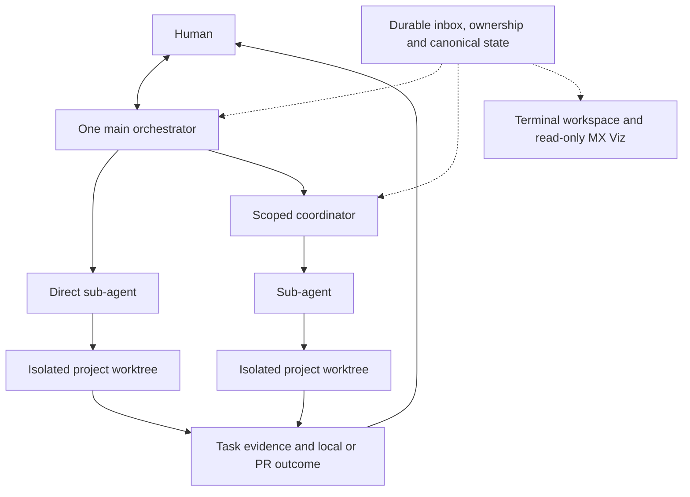

<h1 align="center">Multplx</h1>

<p align="center">
  <strong>The agent distro that extends yourself deterministically.</strong>
</p>

<p align="center">
  <a href="LICENSE"></a>
  <a href="https://github.com/KashyapTan/Multplx/stargazers"></a>
  <a href="docs/getting-started.md#requirements"></a>
</p>

<p align="center">
  <a href="docs/getting-started.md"></a>
  <a href="docs/README.md"></a>
  <a href="CONTRIBUTING.md"></a>
</p>

## Multplx

Multplx is an agent coordination distribution for maintainers who want several software tasks moving without becoming the session manager.
You work through one orchestrator, which routes implementation and research to independent sub-agents in isolated worktrees and can delegate bounded domains to scoped sub-orchestrators.

The distribution includes an orchestration contract, focused skills, local coordination tools and durable state conventions.
The global `multplx` command opens one workspace from any directory, with the existing harness conversation coordinating work across repositories.

## Why Multplx

- **One conversation** - request work, answer real decisions, and receive outcomes through one orchestrator.
- **Parallel isolation** - sub-agents work independently in built-in Git worktree allocations instead of sharing a checkout.
- **Durable supervision** - validated status events, a wake queue, and harness-specific turn-end guards keep work observable without an idle model loop.
- **Clear ownership** - agents coordinate and implement accepted work; the human resolves missing product choices and performs PR merges.
- **Agent delivery, human merges** - implementers commit, push task branches and open or update PRs; humans perform PR merges.
- **Restart-proof operation** - disk state and runtime endpoints let a new orchestrator session reconcile work already under way.

## Core Features

- An orchestrator coordinates independent sub-agents and optional scoped coordinators through the model described in [Architecture](docs/architecture.md).
- Every implementation or research task receives an isolated worktree and a visible endpoint on the tmux reference backend or an experimental Herdr or cmux backend.
- Event-driven supervision combines validated reporting, durable wakes, current-state reconciliation, and guarded turn boundaries without making an append-only status log the source of truth.
- Branch publication uses ordinary authentication and revision-bound evidence as described in [Delivery](docs/delivery.md); local-only tasks stay local and review evidence remains separate.
- Declarative [workflows](docs/workflows.md) compose explicit human interactions, orchestrator and sub-agent stages, deterministic commands, review, and delivery from immutable run snapshots.
- [vplan](docs/vplan.md) provides annotated HTML reviews, while [mx-viz](docs/viz.md) renders a disposable read-only system view.
- [mx-doctor](docs/doctor.md), [task journals](docs/journal-events.md), and timelines expose health and history without becoming control-flow authorities.
- Dispatch profiles and capacity-aware queuing select verified harnesses without dropping work when local or configured API headroom is tight.

## Getting Started

You need macOS or Linux, one verified harness - Claude Code, Codex, Cursor, or Pi - plus the universal toolchain listed in the [getting-started guide](docs/getting-started.md).
tmux is the reference runtime backend; Herdr and cmux are experimental alternatives.

Install a verified platform release with matching runtime assets, then run `multplx` from any directory.
The [getting-started guide](docs/getting-started.md) covers package installation and the optional source build.
Bare `multplx` opens the terminal workspace; `multplx shell` opens an explicit activation shell.

Remember an existing local checkout and enter the same orchestrator conversation:

```sh
multplx projects register ~/dev/my-app --alias my-app
multplx my-app
multplx chat codex
```

Discovery roots are optional, and selecting a project never creates another main orchestrator or changes existing task bindings.
For example, ask in chat:

```text
Fix login in my-app, investigate the flaky test in repo-two, and research feature C in repo-three.
```

The orchestrator tracks each request independently with its own checkout, starting revision and evidence.
Existing dirty files remain in the user's checkout while implementation uses isolated worktrees.
Use `multplx task --project my-app "Fix login"` for durable command-line intake; its receipt confirms acceptance rather than claiming that implementation has started.

Continue with [Getting Started](docs/getting-started.md) for installation, local reuse, discovery, connection limits, backend selection and ordinary Git/forge authentication.

## Built-in skills

Claude uses the slash form shown here; codex uses the same names with `$`, such as `$afk`.

| Skill | Purpose |
| --- | --- |
| `/afk` | Enter away-mode supervision for a walk-away stretch. |
| `/recap` | Recap visible events since the previous real maintainer message. |
| `/catchup` | Generate a standalone current-status report from bounded local state. |
| `/updatemultplx` | Fast-forward a source installation and registered persistent homes to the latest Multplx revision. |
| `/stow` | Route durable session knowledge to its correct owner before a context reset. |
| `/create-workflow` | Draft and validate a reusable declarative workflow. |

## Architecture



Sub-agents share one coordination protocol without approval ranks.
They are autonomous agents with a different workflow scope, coordinated through durable briefs, runtime endpoints, and validated return paths.

## Documentation

| Read this | For |
| --- | --- |
| [Documentation index](docs/README.md) | Reading paths by audience and task |
| [Getting started](docs/getting-started.md) | Installation, local project reuse and first task intake |
| [Architecture](docs/architecture.md) | Orchestration, supervision, state and ownership boundaries |
| [Configuration](docs/configuration.md) | `MX_HOME`, harnesses, dispatch, toolchain, and local settings |
| [Delivery](docs/delivery.md) | Branch publication, current evidence, and human-only PR merges |
| [tmux](docs/tmux-backend.md), [Herdr](docs/herdr-backend.md), [cmux](docs/cmux-backend.md) | Reference and experimental runtime setup |
| [Operations](docs/doctor.md) | Health checks and recovery entry points |
| [Contributing](CONTRIBUTING.md) | Development workflow, conventions, and tests |

Documentation placement and audience ownership are defined in [Documentation audiences](docs/documentation-audiences.md).

## Contributing

Contributions are welcome.
See [CONTRIBUTING.md](CONTRIBUTING.md) for the development workflow, documentation ownership rules, and focused test commands.

## License

Multplx is released under the [MIT License](LICENSE).
