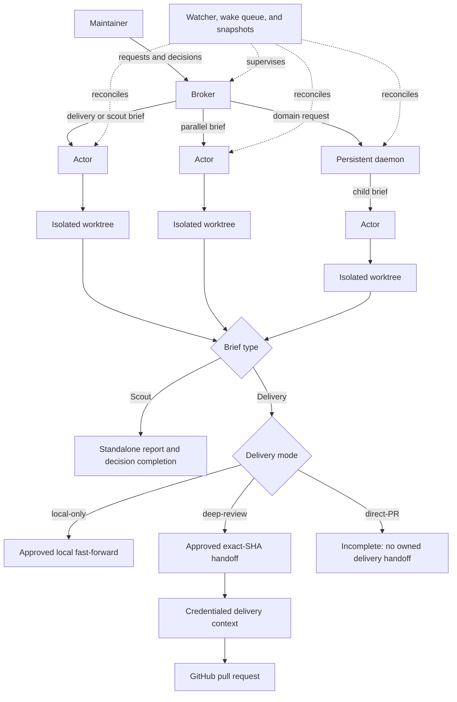

<h1 align="center">Multplx</h1>

<p align="center">
  <strong>Talk to one agent. Deliver with independent actors.</strong>
</p>

<p align="center">
  <a href="LICENSE"></a>
  <a href="https://github.com/KashyapTan/Multplx/stargazers"></a>
  <a href="docs/getting-started.md#requirements"></a>
</p>

<p align="center">
  <a href="docs/getting-started.md"></a>
  <a href="docs/README.md"></a>
  <a href="CONTRIBUTING.md"></a>
</p>

## Multplx

Multplx is an agent coordination distribution for maintainers who want several software tasks moving without becoming the session manager.
You work through one broker, which routes delivery and investigation work to independent actors in isolated worktrees and can delegate recurring domains to persistent daemons.

The repository is the distribution: a broker contract, focused skills, local orchestration tools, safety policy, and durable state conventions.
The global `multplx` command activates that distribution from any directory, after which a verified coding-agent harness takes the broker role while you retain product direction, architecture decisions, destructive choices, and merge approval.

## Why Multplx

- **One conversation** - request work, answer real decisions, and receive outcomes through one broker.
- **Parallel isolation** - actors work independently in Treehouse-managed git worktrees instead of sharing a checkout.
- **Durable supervision** - validated status events, a wake queue, and harness-specific turn-end guards keep work observable without an idle model loop.
- **Explicit authority** - product, architecture, destructive, security-sensitive, and merge decisions remain with the maintainer unless a narrowly configured routine policy applies.
- **Safe delivery** - every agent session stops at local commits; a separate credentialed context pushes only an approved exact SHA.
- **Restart-proof operation** - disk state and runtime endpoints let a new broker session reconcile work already under way.

## Core Features

- A broker coordinates independent actors and optional persistent daemons through the model described in [Architecture](docs/architecture.md).
- Every delivery or scout task receives an isolated worktree and a visible endpoint on the tmux reference backend or an experimental Herdr or cmux backend.
- Event-driven supervision combines validated reporting, durable wakes, current-state reconciliation, and guarded turn boundaries without making an append-only status log the source of truth.
- Three explicit delivery modes - `deep-review`, `direct-PR`, and `local-only` - preserve the same no-agent-credentials boundary described in [Delivery](docs/delivery.md).
- Declarative [workflows](docs/workflows.md) compose maintainer decisions, broker and actor stages, deterministic commands, review, and delivery from immutable run snapshots.
- [vplan](docs/vplan.md) provides annotated HTML reviews, while [mx-viz](docs/viz.md) renders a disposable read-only system view.
- [mx-doctor](docs/doctor.md), [task journals](docs/journal-events.md), and timelines expose health and history without becoming control-flow authorities.
- Dispatch profiles and capacity-aware queuing select verified harnesses without dropping work when local or configured API headroom is tight.

## Getting Started

You need macOS or Linux, one verified harness - Claude Code, Codex, Cursor, or Pi - plus the universal toolchain listed in the [getting-started guide](docs/getting-started.md).
tmux is the reference runtime backend; Herdr and cmux are experimental alternatives.

Clone once and register that checkout as the global Multplx code root and operational home:

```sh
git clone https://github.com/KashyapTan/Multplx.git
cd Multplx
bin/mx-launcher-install.sh
```

Ensure `~/.local/bin` is on `PATH`, then activate Multplx from any directory and choose one installed harness:

```sh
multplx
codex
# or: claude
# or: agent
# or: pi
```

Approve the repository trust prompt when your harness presents one.
The broker runs its session-start checks, reports missing tools, and waits for your consent before installing anything it supports automatically.

Then make a concrete request in chat:

```text
Add my project from https://github.com/example/project, then investigate the flaky login test.
```

Continue with [Getting Started](docs/getting-started.md) for managed installation, shell activation, backend selection, project intake, first-run checks, and the separate delivery credential setup.

## Built-in skills

Claude uses the slash form shown here; codex uses the same names with `$`, such as `$afk`.

| Skill | Purpose |
| --- | --- |
| `/afk` | Enter away-mode supervision for a walk-away stretch. |
| `/recap` | Recap visible events since the previous real maintainer message. |
| `/catchup` | Generate a standalone current-status report from bounded local state. |
| `/updatemultplx` | Fast-forward the running primary and registered daemons to the latest Multplx revision. |
| `/stow` | Route durable session knowledge to its correct owner before a context reset. |
| `/create-workflow` | Draft and validate a reusable declarative workflow. |

## Architecture



Actors never become ranked subordinates of the broker.
They are autonomous agents with a different workflow scope, coordinated through durable briefs, runtime endpoints, and validated return paths.

## Documentation

| Read this | For |
| --- | --- |
| [Documentation index](docs/README.md) | Reading paths by audience and task |
| [Getting started](docs/getting-started.md) | A safe first run from clone through project intake |
| [Architecture](docs/architecture.md) | Actors, daemons, supervision, state, and ownership boundaries |
| [Configuration](docs/configuration.md) | `MX_HOME`, harnesses, dispatch, toolchain, and local settings |
| [Delivery](docs/delivery.md) | Local validation, exact-SHA handoff, and credential separation |
| [tmux](docs/tmux-backend.md), [Herdr](docs/herdr-backend.md), [cmux](docs/cmux-backend.md) | Reference and experimental runtime setup |
| [Operations](docs/doctor.md) | Health checks and recovery entry points |
| [Contributing](CONTRIBUTING.md) | Development workflow, conventions, and tests |

Documentation placement and audience ownership are defined in [Documentation audiences](docs/documentation-audiences.md).

## Contributing

Contributions are welcome.
See [CONTRIBUTING.md](CONTRIBUTING.md) for the development workflow, documentation ownership rules, and focused test commands.

## License

Multplx is released under the [MIT License](LICENSE).
