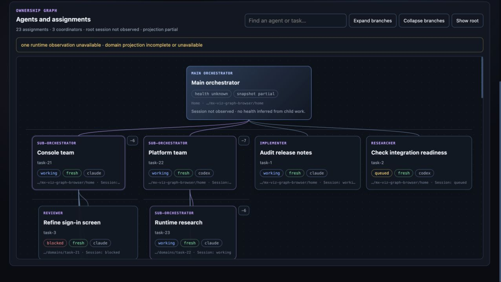

# Multplx

**One conversation. Parallel agents. Durable coordination.**

Multplx lets you ask one orchestrator to work across several repositories while independent agents implement, research and review in isolated Git worktrees.
You can follow everything in a terminal workspace or the MX Viz agent graph, answer decisions in one chat, and keep task records when sessions restart.
Agents can open pull requests; you decide when to merge.

## Install from source

On macOS or Linux, install [the prerequisites](docs/getting-started.md#prerequisites), including Rust/Cargo and a supported agent CLI.
Then run:

```sh
git clone https://github.com/KashyapTan/Multplx.git
cd Multplx
./install.sh
export PATH="$HOME/.local/bin:$PATH"
multplx paths
```

The installer builds and installs the **full runtime**, including the command, instructions, skills, hooks, workflows and dashboard assets.
You do not need to find, name or assemble a release package.
It keeps its runtime and operational home separate from your clone, does not start an agent, and does not require `sudo`.
The first build can take several minutes; later builds reuse Cargo's cache.
Add the printed binary directory to your shell's `PATH` once to make the command available in future terminals.
Use `./install.sh --help` for installation paths and `./install.sh --upgrade` for an existing installation.

### Install without keeping a clone

A source-download bootstrap is included as `install-from-github.sh`.
Once these installer scripts are published on the repository's `main` branch, this command downloads a temporary checkout and performs the same full installation:

```sh
curl -fsSL https://raw.githubusercontent.com/KashyapTan/Multplx/main/install-from-github.sh | bash
```

This is a source build, so the same prerequisites apply.
The URL is not usable until the new scripts have been pushed to the public repository.
[Getting started](docs/getting-started.md) covers prerequisites, first use, upgrades, uninstall and troubleshooting.

## Your first task

Use an existing Git repository with at least one commit and a supported, authenticated harness:

```sh
multplx projects register ~/dev/my-app --alias my-app
multplx chat codex
```

Replace `codex` with `claude`, `cursor` or `pi` if that is your installed harness.
In the chat, ask:

```text
Fix the login issue in my-app. Run the relevant tests and open a PR.
```

For independent work across repositories, register each checkout and ask:

```text
Fix login in my-app, investigate the flaky tests in api, and research the export feature in dashboard.
```

Open `multplx` in another terminal to see the workspace; press `v` for MX Viz or `c` to connect to the main conversation.
You can also submit a durable request from the terminal:

```sh
multplx task --project my-app "Fix the login issue"
multplx workspace --plain
```

A task receipt means accepted, not already running or finished.
Implementation starts from a committed revision in an isolated worktree; uncommitted files stay in your original checkout.

## What you can do

| Feature | Why it is useful |
| --- | --- |
| One chat across repositories | Request independent changes and research without managing a conversation per task. |
| Parallel workers | Implementation, research and review can progress independently in isolated worktrees. |
| Scoped sub-orchestrators | Give a project or idea its own coordinator, with nested workers and durable parent reports. |
| Existing local projects | Register checkouts, choose aliases and optionally discover nested repositories without cloning everything again. |
| Terminal workspace | Browse projects, tasks, decisions and domains; submit work, refresh state and open the main chat. |
| MX Viz | See the orchestrator/coordinator/worker graph, search or collapse branches, and open exact task details and artifacts. |
| Durable requests and dependencies | Retry uncertain submissions with the same request ID and delay dependent work until prerequisites finish. |
| Capacity-aware dispatch | Queue accepted work when capacity is tight instead of losing it. |
| Persistent assignments | Keep a coordinator or agent registered between tasks and retain its owned work across restarts. |
| Workflows | Run a reusable sequence of agent, command, review, delivery and explicit human-decision stages. |
| Optional review tools | Request deep-review or annotated HTML vplan reviews when you need them. |
| Delivery evidence | Track exact commits, tests, limitations and PRs; keep implementation, checks, review and merge distinct. |
| Away-mode supervision | Explicitly enter away mode to supervise work and collect decisions while you are away. |
| Recovery and diagnostics | Inspect health, snapshots, task timelines and durable ownership after a restart or failure. |
| Harness choice | Use Claude Code, Codex CLI, Cursor CLI or Pi through supported adapters; tmux is the reference backend. |
| Full local installation | Keep the command, matching runtime assets and operational data separate; upgrade or uninstall without deleting repositories. |

Read the [human command reference](docs/commands.md) for commands and examples, or the [user guide](docs/user-guide.md) for workflows explained step by step.



The screenshot uses synthetic example data.
The dashboard reports missing, partial or stale observations explicitly; it does not infer that an unobserved agent is healthy.

## Practical limits

You provide the agent CLI, its authentication/subscription and ordinary Git/forge credentials.
Multplx is not a model provider, and Codex Desktop is not a selectable shell backend.
Current end-to-end candidate evidence covers Codex; other provider acceptance limits are recorded in the [user guide](docs/user-guide.md#release-status).
Herdr and cmux are experimental runtime backends.
A recorded task or session does not guarantee unattended completion, and PR merges remain human-only.

## Documentation

| Guide | Read it for |
| --- | --- |
| [Getting started](docs/getting-started.md) | Installation, first task, upgrade and uninstall |
| [Human command reference](docs/commands.md) | Features, commands, examples and terminal keys |
| [User guide](docs/user-guide.md) | Everyday project, task, coordinator, workflow and recovery use |
| [Documentation index](docs/README.md) | All maintained operator and architecture references |
| [Configuration](docs/configuration.md) | Toolchain, dispatch, paths and local settings |
| [Architecture](docs/architecture.md) | Ownership, isolation, supervision and state |
| [Contributing](CONTRIBUTING.md) | Development workflow and tests |

Documentation ownership is defined in [Documentation audiences](docs/documentation-audiences.md).
Multplx is released under the [MIT License](LICENSE).
