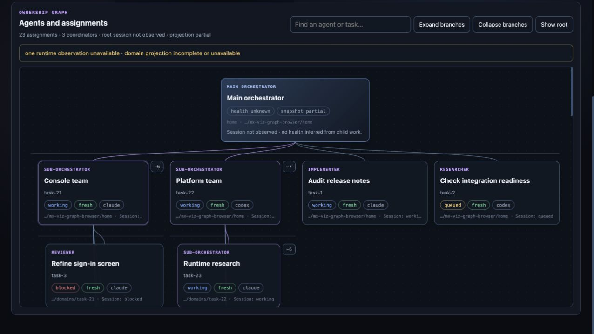
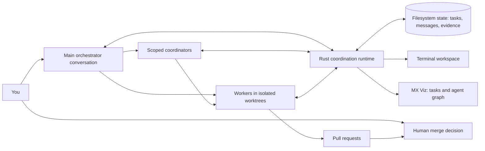

<h1 align="center">Multplx</h1>

<h3 align="center">One conversation. Parallel agents. Durable coordination.</h3>

<p align="center">
  <a href="./LICENSE"></a>
  <a href="https://github.com/KashyapTan/Multplx/actions/workflows/ci.yml"></a>
  <a href="https://github.com/KashyapTan/Multplx/stargazers"></a>
</p>

<p align="center">
  <a href="./docs/getting-started.md"></a>
  <a href="./docs/README.md"></a>
  <a href="./CONTRIBUTING.md"></a>
</p>

---

## Multplx

An open-source workspace for coordinating AI agents across your repositories through **one main conversation**.
Ask for a bug fix, a research task and a review together; the orchestrator delegates work, keeps track of ownership and brings decisions back to you.
Follow progress in the terminal workspace or the MX Viz dashboard while agents work in isolated Git worktrees.
Agents can open pull requests; you decide when to merge.

---

## Why Multplx

- **One chat across projects** - Request work across several repositories without managing a conversation for every task.
- **Parallel progress** - Let implementation, research and review proceed independently, with capacity limits and queued dispatch.
- **Your existing tools** - Register local checkouts and use a supported agent CLI with your own authentication.
- **Continuity across restarts** - Keep durable task records, messages, decisions and delivery evidence when sessions end.
- **Visible ownership** - See which orchestrator, coordinator or worker owns each assignment and what needs your attention.
- **Human control** - Choose workflows and optional reviews; retain control of PR merges.

---

## Core Features

- **Terminal workspace** - Browse projects, tasks, decisions and domains; submit requests or connect to the main conversation from a responsive Ratatui dashboard.
- **MX Viz agent graph** - Explore the main orchestrator, nested coordinators and workers, search assignments, collapse branches and open task details and artifacts.
- **Project registration and discovery** - Reuse local repositories, assign aliases and optionally discover nested checkouts without cloning them again.
- **Isolated worktrees** - Give implementation tasks separate working directories while preserving uncommitted changes in your original checkout.
- **Managed standing agents** - Delegate to Multplx-managed standing workers and scoped coordinators by default, including nested work; retain availability for your follow-up after delivery. See the [delegation model](./docs/user-guide.md#the-working-model).
- **Durable task intake and dependencies** - Retry submissions with the same request ID and hold dependent work until prerequisites finish.
- **Persistent assignments and recovery** - Retain owned work across restarts and inspect health, snapshots, task timelines and unresolved ownership.
- **Reusable workflows** - Sequence agent work, commands, reviews, delivery and human decisions; opt into deep-review or annotated HTML vplan reviews when needed.
- **Delivery evidence** - Record exact commits, tests, limitations and PRs, keeping implementation, checks, review and merge status distinct.
- **Away-mode supervision** - Explicitly enable supervision while you are away and collect decisions for your return.
- **Harness choice** - Use Codex CLI, Claude Code, Cursor CLI or Pi through supported adapters, with tmux as the reference backend.
- **Full local installation** - Install the CLI and matching instructions, skills, hooks, workflows and dashboard assets together, separate from your source checkout.

See the [human command reference](./docs/commands.md) for commands and examples, and the [user guide](./docs/user-guide.md) for everyday workflows.

---

## Demo

MX Viz shows the agent hierarchy alongside task ownership and delivery details:



This screenshot uses synthetic example data.
Missing, partial and stale observations are shown explicitly; an unobserved agent is not assumed healthy.

---

## Getting Started

### Prerequisites

Use **macOS or Linux** with Bash, Git and current stable Rust/Cargo for the source build.
The runtime also uses `gh`, `jq`, `tmux` and `lsof`.
Install and authenticate a supported agent CLI before starting your first conversation: Codex CLI (`codex`), Claude Code (`claude`), Cursor CLI (`agent` or `cursor-agent`), or Pi (`pi`).
Multplx does not install a model provider or sign you into one.
See [platform-specific prerequisite commands](./docs/getting-started.md#prerequisites).

### Install from source

Clone the repository and run one installer:

```sh
git clone https://github.com/KashyapTan/Multplx.git
cd Multplx
./install.sh
export PATH="$HOME/.local/bin:$PATH"
multplx paths
```

Already cloned it? Run `./install.sh` from your existing clone.
The installer builds the full runtime without `sudo` and does not launch an agent.
The first build can take several minutes.
Add the printed binary directory to your shell's `PATH` for future terminals; the default is `~/.local/bin`.
Use `./install.sh --upgrade` to update an existing installation.

### Install from anywhere

Download a temporary checkout and run the same source installer:

```sh
curl -fsSL https://raw.githubusercontent.com/KashyapTan/Multplx/main/install-from-github.sh | bash
export PATH="$HOME/.local/bin:$PATH"
multplx paths
```

The same build prerequisites apply.
See [Getting started](./docs/getting-started.md) for custom paths, upgrades, uninstall and troubleshooting.

### Your first task

Register an existing Git repository with at least one commit, then start the orchestrator chat:

```sh
multplx projects register ~/dev/my-app --alias my-app
multplx chat codex
```

Replace `codex` with `claude`, `cursor` or `pi` for your installed harness.
Ask in the chat:

```text
Fix the login issue in my-app. Run the relevant tests and open a PR.
```

Register more repositories to request independent work in the same conversation:

```text
Fix login in my-app, investigate the flaky tests in api, and research the export feature in dashboard.
```

Open `multplx` in another terminal to browse the workspace; press `v` for MX Viz or `c` to connect to the main conversation.
The terminal UI is a dashboard and task-entry surface, not a separate AI chat.
You can also submit a durable request or print workspace state directly:

```sh
multplx task --project my-app "Fix the login issue"
multplx workspace --plain
```

A task receipt means accepted, not already running or finished.
Implementation starts from a committed revision in an isolated worktree; uncommitted files stay in your original checkout.

### Developers

Build the runtime before running behavior checks:

```sh
cargo build --release --workspace --locked
cargo fmt --all -- --check
cargo clippy --locked --workspace --all-targets --all-features -- -D warnings
cargo test --locked --workspace
target/release/mx test-run --all --jobs auto
target/release/mx doc-audience-check
```

See [Contributing](./CONTRIBUTING.md) for test dependencies and repository conventions.

---

## Architecture

One orchestrator owns the conversation; scoped coordinators and workers own bounded assignments.
The Rust runtime keeps coordination state on the filesystem and exposes it to the terminal workspace and read-only browser dashboard.


```mermaid
graph LR
  Human["You"] --> Chat["Main orchestrator conversation"]
  Chat --> Coordinator["Scoped coordinators"]
  Chat --> Workers["Workers in isolated worktrees"]
  Coordinator --> Workers
  Chat <--> Runtime["Rust coordination runtime"]
  Coordinator <--> Runtime
  Workers <--> Runtime
  Runtime <--> State[("Filesystem state: tasks, messages, evidence")]
  Runtime --> TUI["Terminal workspace"]
  Runtime --> Viz["MX Viz: tasks and agent graph"]
  Workers --> PR["Pull requests"]
  Human --> Merge["Human merge decision"]
  PR --> Merge
```

You supply ordinary Git/forge credentials and your harness authentication or subscription.
Current end-to-end candidate evidence covers Codex; other provider limits are recorded in the [release status](./docs/user-guide.md#release-status).
Herdr and cmux are experimental runtime backends; Codex Desktop is not a selectable shell backend.
A recorded task or session does not guarantee unattended completion.

---

## Documentation

| Document | Description |
| --- | --- |
| [Documentation index](./docs/README.md) | Full documentation map and reading paths |
| [Getting started](./docs/getting-started.md) | Installation, first task, upgrades and uninstall |
| [Human command reference](./docs/commands.md) | Features, commands, examples and terminal keys |
| [User guide](./docs/user-guide.md) | Everyday project, task, coordinator and recovery workflows |
| [Workspace entry](./docs/workspace-entry.md) | Launch from anywhere and use one shared conversation |
| [MX Viz](./docs/viz.md) | Task portfolio, agent graph and artifact browsing |
| [Configuration](./docs/configuration.md) | Toolchain, dispatch, paths and local settings |
| [Workflows](./docs/workflows.md) | Reusable stages and explicit human decisions |
| [Worktrees](./docs/worktrees.md) | Allocation, isolation and cleanup |
| [Scoped coordinators](./docs/scoped-coordinators.md) | Project and idea coordination with nested workers |
| [Delivery](./docs/delivery.md) | Evidence, PR publication and completion semantics |
| [Architecture](./docs/architecture.md) | Runtime ownership, supervision and state |
| [Contributing](./CONTRIBUTING.md) | Development workflow and validation |

Documentation ownership is defined in [Documentation audiences](./docs/documentation-audiences.md).

---

## Contributing

Contributions are welcome.
Read [Contributing](./CONTRIBUTING.md) before opening a PR.

---

## License

[MIT](./LICENSE)

---

## Sponsor

<a href="https://github.com/sponsors/KashyapTan">
  
</a>
