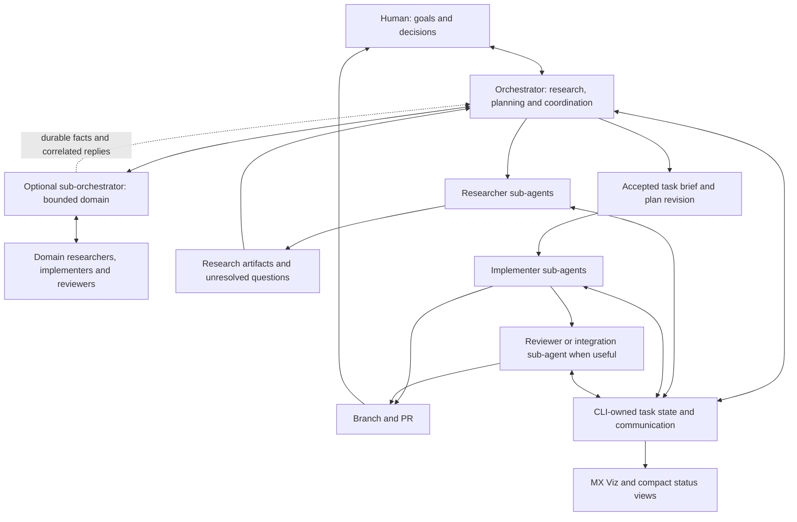

# Architecture assessment: one orchestrator, 10-20 concurrent tasks

## Verdict and evidence boundary

The architecture is a good fit for one human managing multiple largely independent software tasks through a dedicated orchestrator.
Keep the Rust CLI, isolated worker sessions, explicit state ownership, durable notifications, correlated replies and human-facing orchestration.
I would not replace this with an unconstrained peer swarm or a distributed platform before measuring the current system.
However, I would not claim that the current design has proved efficient or reliable at 20 concurrent tasks.
This assessment is based on source inspection and primary-source research on 2026-09-14 at repository commit `c09ede3d015799739354ff00e5b0e5e84845737e`; no live 20-agent benchmark was performed.

The revised [porting guide](../../porting.md) owns accepted product requirements.
The user accepted these recommendations on 2026-09-14, including filesystem storage and the expanded MX Viz experience.
The [accepted architecture contract](../../porting.md#accepted-architecture-contract), A1-A11, now owns their required semantics and phase allocation.
This assessment remains the source-backed rationale; acceptance of the design is not evidence that the runtime or performance targets have been implemented.
The local historical `firstmate/` tree and private operational homes were not examined.
The user subsequently authorized public Secondmate research; [the sub-orchestrator assessment](sub-orchestrator-assessment.md) records the evidence and tradeoffs behind required A11 scope.

## Accepted shape

The main orchestrator owns conversation, research and synthesis, planning, delegation, task prioritization, human decisions and progress communication.
It does not implement project code, fix worker code or write project tests itself.
It may write coordination artifacts, including briefs, plans, research summaries and decision records.
Sub-agents have researcher, implementer, reviewer or scoped sub-orchestrator assignments and may delegate further within scope.
A sub-orchestrator delegates project code and test changes and manages one bounded domain under the main human-facing orchestrator.
Persistence and execution provider remain separate from assignment role.

The arrows represent asynchronous work and durable records; they do not require every task to traverse every box.
A well-specified fix can go directly to an implementer.
An underspecified feature needs facts and scope clarification before implementation, but research cannot choose an unstated user preference.
An explicitly selected workflow can include iterative discussion and requested vplan use, with every declared stage preserved.

## What is already worth keeping

| Mechanism | Source evidence | Architectural value |
| --- | --- | --- |
| Atomic file publication | [filesystem.rs](../../crates/multplx-core/src/filesystem.rs), `atomic_replace_with_fault` flushes data, renames within the directory and syncs the parent | Strong local-state foundation; plain files are not automatically unreliable. |
| Queue before notification | [supervision.rs](../../crates/multplx-cli/src/supervision.rs), `watch` calls `append_wake` before emitting actionable output | A missed terminal wake need not erase the underlying event. |
| Serialized queue mutation | [wake.rs](../../crates/multplx-core/src/wake.rs), `WakeQueue` locks append/drain and restores abandoned drains | Preserves ordered state transitions across processes. |
| Event history separate from current state | [actor_state.rs](../../crates/multplx-backend/src/actor_state.rs), `reconcile`, and [classification.rs](../../crates/multplx-core/src/classification.rs) | Avoids treating an old status line as a fresh observation. |
| Correlated replies | [pending_reply.rs](../../crates/multplx-domain/src/lifecycle/pending_reply.rs), `create`, `confirm_delivery`, `tick` | Existing reusable machinery distinguishes delivery from a response and supports recovery. |
| Durable workflow execution | [workflow.rs](../../crates/multplx-domain/src/workflow.rs) and [workflow_runtime.rs](../../crates/multplx-cli/src/workflow_runtime.rs) | Snapshot, stage-order, contract and per-run locking mechanisms are useful independent of old roles. |
| Recoverable execution resources | [spawn.rs](../../crates/multplx-domain/src/lifecycle/spawn.rs), [teardown.rs](../../crates/multplx-domain/src/lifecycle/teardown.rs) and [session_lock.rs](../../crates/multplx-core/src/session_lock.rs) | Preserves work and recorded ownership when an agent process disappears. |
| Disposable visualizer | [viz.rs](../../crates/multplx-services/src/local_services/viz.rs) and [docs/viz.md](../../docs/viz.md) | GET-only display over canonical snapshots avoids a second task database or authority path. |

The important separation is between agent judgment and deterministic bookkeeping.
The orchestrator decides what to do; the CLI validates and records who owns the work and which transition actually happened.
Removing the engineering playbooks should strengthen that distinction.

## Priority 1: delivery is not handling

The queue's recovery boundary currently ends at successful publication to stdout.
In [CLI wake draining](../../crates/multplx-cli/src/lib.rs), `drain_with_publish` writes records and flushes stdout; in [WakeQueue](../../crates/multplx-core/src/wake.rs), the drain file is then removed.
Neither operation proves that the orchestrator has persisted a decision, dispatched a dependent task or otherwise dealt with that event.

A crash after display but before handling is therefore a gap in end-to-end acknowledgement.
Other state and startup reconciliation may recover the underlying condition, so this is not a claim that every such crash permanently loses work.
It is a reason not to describe queue publication as proof of completed coordination.

Accepted direction (A3): let draining durably claim a batch into an orchestrator inbox, then acknowledge each event after its disposition is recorded.
A disposition may be handled, superseded by newer state, waiting on a named condition or linked to a durable follow-up task.
An abandoned claim becomes available for retry.
Use stable event/request IDs and idempotent transitions so a repeated delivery is safe.
Keep critical task transitions available until handled; coalesce only replaceable progress observations.
Do not hold the queue lock while a model thinks, calls a backend or waits for the user.

This is a small extension to the existing queue owner, not a reason to adopt a message broker.
Temporal similarly recommends idempotent activities and persists activity results through its workflow engine; I would borrow that reliability principle without importing its platform here. [Temporal activities](https://docs.temporal.io/activities)

Acceptance: kill the orchestrator after display and before disposition, restart it, and show that the pending task action is recovered once without a duplicated spawn or PR.

## Priority 2: distinguish task, attempt and accepted plan

The current [report binding](../../crates/multplx-domain/src/supervision.rs), `bound_task`, validates the task ID from environment or worktree identity.
It does not independently bind an execution generation or accepted plan revision in that path.
That is useful task routing, but it is insufficient by itself to distinguish an old process from a replacement working on a revised assignment.

Accepted direction (A2): preserve a stable task ID while assigning each execution attempt its own generation and binding it to a brief revision.
Include those identities in messages and completion evidence, along with the relevant branch/commit where applicable.
Reject a stale attempt's completion as a transition of the current attempt; retain it as historical evidence.
A restarted session can retain its generation only when it is demonstrably the same execution; a replacement gets a new one.
An edited plan needs an explicit revision, not a rewritten brief silently inherited by whichever agent reads it next.

The accepted envelope fields and applicability rules now live in [A2](../../porting.md#a2-task-execution-and-accepted-brief-identity).

Use artifact references and retrieve original evidence when needed instead of copying entire conversations between agents.
Avoid putting implementation details into this envelope unless they are needed for routing or validation.
The user conversation remains the origin of scope decisions; a peer message or tool marker cannot amend scope or authorize a merge.

Generation checks protect state acceptance, not arbitrary side effects by a still-running old process.
Cancellation/reassignment must also reconcile the actual process and worktree before a new writer takes over that resource.
Do not discard the old worktree merely because its attempt is superseded.

Acceptance: an old worker reports done after replacement, a new user plan arrives mid-task, and a delayed reviewer reports against an old commit; none silently advances the current task.

## Priority 3: prevent observation from delaying coordination

The [system snapshot](../../crates/multplx-cli/src/system_snapshot.rs) builds task rows serially and invokes `actor_state` through a subprocess for each task.
That call uses `Command::output` without its own outer timeout at this layer; backend-specific bounds may still apply below it.
The [MX Viz service](../../crates/multplx-services/src/local_services/viz.rs), `refresh_snapshot`, holds its runtime mutex while running snapshot generation, which has a 60-second service-side deadline.
The current UI [polls](../../share/viz/app.js) periodically; [docs/viz.md](../../docs/viz.md) specifies a default 2.5-second client interval and 2-second refresh cache.

The cache and coalescing are good, but one expensive observation can delay a whole refresh.
The [watch loop](../../crates/multplx-cli/src/supervision.rs) also evaluates due custom checks and PR polls serially, with a default 30-second check timeout.
If 20 due checks each exhausted that timeout, the check section alone could take about 10 minutes; that is a code-derived worst-case calculation, not observed performance.

Accepted direction (A4): retain the current event-driven watcher and polling fallback, but move slow observations into a bounded collection path with per-operation deadlines and partial results.
Publish last-known observations with explicit age, source and unknown/error state.
Do not hold a service-global mutex across external commands.
Keep one refresh in flight and serve the last good snapshot while refreshing.
Give notification ingestion priority over slow forge checks and expensive timeline collection.
Use compact summaries at orchestrator startup and retrieve full task detail only when needed.

A shared projection should serve the CLI, orchestrator summaries and MX Viz.
Twenty tasks should not cause every viewer to run twenty independent fresh backend probes.
Use existing cache and state owners before considering a new always-running service.

Acceptance: one backend stalls while others finish tasks; healthy updates and the cached dashboard remain available, and stale observations are visibly stale.

## Priority 4: optimize completed work rather than maximum fan-out

Twenty user tasks are not necessarily twenty active models, and one task may need several models at different times.
The [existing headroom queue](../../crates/multplx-backend/src/headroom.rs), `queue_drain`, already preserves deferred work and launches one queued item per invocation.
Keep admission control, but make the policy about real capacity and dependencies rather than requiring the model to perform a resource-ranking ceremony every time.

Accepted direction (A5): distinguish accepted tasks, runnable tasks, active sessions, waiting tasks and ready PRs.
Use configured limits and observed capacity for model calls, local builds and project-specific shared resources.
Preserve priority, avoid starving small tasks behind a large one and allow users to change priorities through the orchestrator.
A resource limit should queue accepted intent rather than demand permission to delegate.
Avoid a fixed same-file prohibition: isolated branches can often progress independently, while semantic interface dependencies can require ordered integration even in different files.

Independent work across several projects is the strongest case for 10-20 concurrent tasks.
Twenty features changing the same subsystem have substantially more integration cost.
Keep an explicit dependency graph and commission an integration sub-agent when work crosses a shared interface.
Do not make the orchestrator repair integration code itself.

Anthropic's multi-agent research system supports orchestrator/worker decomposition and artifact handoffs, but also reports coordination overhead and limits for coding tasks with shared dependencies; those research results are not a benchmark of Multplx. [Multi-agent research system](https://www.anthropic.com/engineering/multi-agent-research-system)
More recent primary research similarly finds that heavily interdependent software tasks can suffer coordination and integration failures as agent count grows; role names alone did not solve its tested project-quality problem. [Patterns and problems in multiagent systems](https://www.anthropic.com/research/multiagent-systems)

Acceptance: compare 1, 5, 10 and 20 accepted tasks with the same representative workload mix and measured resource use, rather than comparing raw spawned-session counts.

## Quality and the human conversation

The orchestrator should remain responsive while research, implementation and checks run asynchronously.
It needs a small durable task summary: objective, accepted revision, current owner/attempt, state, dependency, latest meaningful change, pending human question and evidence pointers.
Do not put all 20 transcripts into its context or replay every operational event as a human-facing update.
A session checkpoint summarizes state and references evidence; it is not a shared mutable conversation for all agents.

Researcher output should preserve facts, source pointers, alternatives and unresolved questions.
The implementer receives the original research artifact plus a clear brief, avoiding repeated paraphrasing through multiple agents.
A useful reviewer receives the accepted scope and exact revision to examine, not merely the implementer's claim that the task is complete.
Peer communication is useful for narrow technical questions, but accepted decisions and completion evidence must return to the owning task so the orchestrator can account for the outcome.

Excellent code quality cannot be guaranteed by either freedom or a mandatory review skill.
Measure behavior correctness, regression results, defects found in review, integration rework and failed outcomes after human merge.
Require truthful evidence tied to the actual revision before describing a PR as ready.
Let the orchestrator allocate independent review where it buys useful confidence; keep deep-review explicitly requested.

Human-only merging creates an intentional final capacity constraint.
Show a prioritized, dependency-aware review queue with concise outcomes and current check evidence so human time is spent evaluating changes rather than reconciling agents.
Batch non-urgent decisions, but surface genuine blockers promptly and do not let unanswered questions stall unrelated work.
The target is less human effort per accepted change, not an inbox containing twenty unexplained PR links.

## Accepted filesystem storage decision

Retain the file-based state store for this redesign, with short scoped locks, atomic writes and explicit ownership.
The number twenty alone does not establish a storage bottleneck.
The nearer risks visible in the code are acknowledgement semantics, cross-record consistency, external-command latency and excessive context sharing.

Atomic replacement of one file does not make a multi-file task transition transactional.
Use a recoverable transaction/receipt pattern for transitions that must update several records together, and test every interruption boundary.
Avoid hand-editing machine state from agents.
Keep journals as observability and read models as derived views, not alternate authoritative task states.

The earlier assessment considered SQLite as a possible later alternative; the user has now explicitly selected filesystem storage for this port.
No database evaluation or migration is an implementation phase or fallback for missed targets.
Any future storage redesign is separate work.
SQLite supports multiple readers but serializes writers; its documentation also cautions against directly sharing one database over network filesystems. [SQLite appropriate uses](https://www.sqlite.org/whentouse.html)
A future multi-machine design would need an explicit transport and ownership model; sharing a folder is not a substitute.

## MX Viz is a release requirement

The dedicated [Phase 10 plan](10-mx-viz-and-scale.html) covers both UI changes and observation cost.
Use a compact task overview grouped by project, expandable into the assignment tree and current workflow stage.
Show researcher/implementer/reviewer, persistence, current attempt, accepted plan revision and task dependencies as distinct facts.
Preserve selected rows and filters between updates.

The human should be able to answer these questions without reading agent transcripts:

- Which requested tasks are progressing, queued, blocked or ready for review?
- Which sub-agent owns the current stage, and what is it waiting on?
- Which plan revision is being implemented, and where is the supporting research?
- Which concrete decisions require my input now?
- Which checks and reviews apply to the current PR revision?
- Is this observation fresh, stale, unknown or only partly visible?

Keep MX Viz read-only and use the same canonical state projection as orchestrator summaries.
Do not introduce a second approval path or an agent-management console as part of this port.

## Accepted launch-anywhere and terminal workspace extension

The user accepted global workspace entry and a thin TUI, with optional recursive discovery roots.
Launch works from any directory; a dev folder is an example only.
Concurrent tasks across repositories are standard orchestrator delegation behavior and do not depend on a particular launch directory or TUI.
[A9 in the porting guide](../../porting.md#a9-launch-anywhere-project-discovery-and-one-shared-chat) owns this accepted behavior; [Phase 11](11-workspace-entry-and-project-discovery.html) implements entry and discovery, while Phase 02 owns project identity.
These requirements extend the design and are not current runtime claims.

The current [launcher](../../crates/multplx-cli/src/launcher.rs) defaults to shell activation and validates a runtime checkout.
[Harness launch](../../crates/multplx-backend/src/harness_launch.rs) changes into that runtime root and refuses another live home owner.
The [project registry](../../crates/multplx-domain/src/project_registry.rs) resolves delivery settings against flat managed-clone locations, and the existing project intake skill prescribes cloning under `projects/`.
Those choices explain why a global executable alone does not eliminate repeated repository setup.

Keep runtime installation, operational home and project discovery roots distinct.
The main architectural risk is accidentally turning project selection into another main orchestrator or a mutable global repository target.
Stable per-task project/checkout binding and durable request correlation let one conversation coordinate independent work across repositories without that ambiguity.
User-owned checkout identity must also reach [refresh](../../crates/multplx-domain/src/lifecycle/system_sync.rs), provisioning and cleanup, so local reuse does not grant managed-clone maintenance over the user's files.

The TUI should expose the existing state and conversation rather than become another model frontend or scheduler.
Discovery must remain incremental and configurable, while attachment and transcript recovery must match the actual provider capabilities.
The release trial includes package-only installation, launches from unrelated/home/repository directories with and without discovery roots, differently nested repositories and a second terminal reconnecting without a second writer.
[A10](../../porting.md#a10-built-in-git-worktree-lifecycle) and the [Treehouse replacement research](treehouse-replacement-assessment.md) add the built-in Git lifecycle while retaining the existing ownership and recovery design.

## Accepted evaluation and rollout priorities

| Priority | Trial | Outcome to record |
| --- | --- | --- |
| First | Print an event, then crash before handling | Durable recovery without depending on chat history or duplicating an action |
| First | Duplicate message, stale attempt and changed brief revision | Correct owner/revision acceptance and retained historical evidence |
| First | Slow backend and twenty mixed task states | Bounded observations, useful partial snapshots and continued healthy progress |
| Next | Known fix versus underspecified feature | Appropriate direct-to-implementer or research/agreement path |
| Next | Independent projects versus coupled changes in one project | Useful throughput, integration failures and rework rather than fan-out |
| Next | Twenty tasks plus nested children and human decisions in MX Viz | Correct counts, evidence links, priorities, freshness and responsive navigation |
| Release | Restart/cancel/reassign during every meaningful transition | No lost work, double ownership, false completion or agent PR merge |

Record p50/p95 event-to-durable-disposition latency, oldest unhandled event age, orchestrator response delay, runnable-to-start delay, snapshot age/latency, local resource saturation and repeated-message rate.
Record completion throughput, correctness, review rework, model usage where available and human decision/review time separately.
A8 owns the accepted MX Viz performance targets and evidence requirements, including cached API, healthy refresh and initial interactivity; none is a current performance claim.
Compare against a small concurrency baseline before claiming that more active agents improve velocity.

The accepted rollout order establishes ownership/revision semantics and durable handling first, then exercises bounded observation and the revised workflow handoffs, then increases concurrency and completes dashboard acceptance with the resulting evidence.
Do not build a general distributed scheduler, a new broker service or a database migration merely to make the architecture look more scalable.
The existing core is worth keeping; its remaining uncertainty should be resolved with targeted failure and workload tests.
