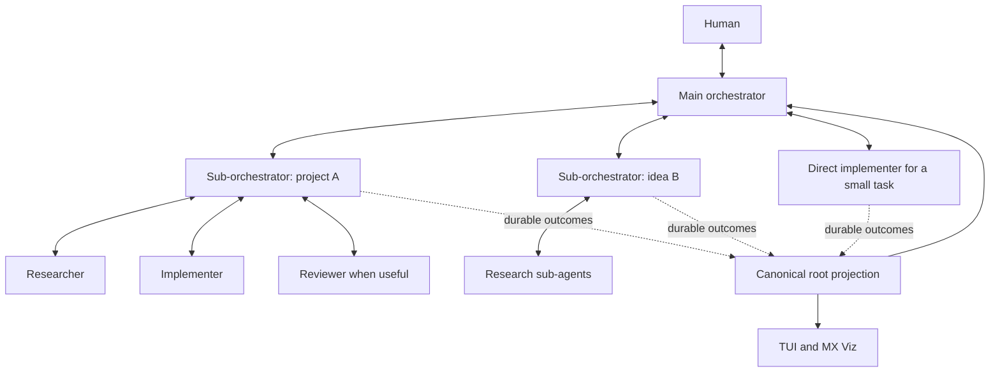

# Scoped sub-orchestrators: Secondmate research and Multplx design

## Verdict and boundary

A domain coordinator is useful for sustained work that would otherwise fill the main orchestrator's context with implementation detail.
It is not a guaranteed speedup: another model turn adds latency, costs capacity and can lose information through summarization.
Keep direct delegation for small tasks and use a sub-orchestrator for a bounded project, repository or idea when coordination work warrants it.
[A11 in porting.md](../../porting.md#a11-scoped-sub-orchestrators) owns the accepted contract; [Phase 05](05-scoped-sub-orchestrators.html) owns implementation.
The shared filesystem, queue, lifecycle and worktree mechanisms remain the implementation base.

Research on 2026-09-14 read public upstream Firstmate documentation and command contracts plus the current local Multplx source.
The user explicitly requested this public Secondmate research; the excluded local `firstmate/` folder and private operational homes were not read.
No upstream code was installed, executed or vendored, and no live hierarchy benchmark was performed.
Upstream `main` URLs describe the version observed on that date and can change; this record distinguishes those observations from our planned design.

## What Secondmate provides

Firstmate's architecture describes persistent secondmates with scoped charters and separate operational homes, launched as direct reports that can manage their own children.
Routing uses the responsibility rather than exclusive repository ownership, and idle homes await assigned work.
Its watcher also distinguishes an endpoint being alive from its child queue making progress.
Those are useful ideas for Multplx's existing home and watcher architecture. [Upstream architecture](https://github.com/kunchenguid/firstmate/blob/main/docs/architecture.md)

Provisioning stores a domain charter and parent binding, and permits multiple scopes over the same project.
Upstream also includes project-clone rules, Treehouse-backed homes and remote placement.
Our design uses existing project identities, private directory homes and the built-in worktree manager, with the current local backend support matrix. [Provisioning contract](https://github.com/kunchenguid/firstmate/blob/main/.agents/skills/secondmate-provisioning/SKILL.md)

The most consequential upstream finding is that agent-generated answers sometimes remained in the secondmate's own chat.
Upstream's parent-channel design therefore publishes durable outcomes from the code that records them, while the model supplies judgment and summaries.
It preserves outcome delivery through teardown and avoids mirroring entire conversations.
For Multplx, adopt this separation with A1/A3 outbox receipts and stable event identity through the parent chain. [Parent-channel design and incident rationale](https://github.com/kunchenguid/firstmate/blob/main/docs/secondmate-parent-channel.md)

The pending-reply mechanism records an expectation before delivery and resolves it from a correlated parent-channel result, not a successful send or unrelated activity.
It uses bounded repair/escalation for a missing reply.
Multplx already has a related implementation, so extend its generation and route checks rather than add another protocol. [Pending-reply command contract](https://github.com/kunchenguid/firstmate/blob/main/bin/fm-pending-reply-lib.sh)

Upstream separates conversational sends from lifecycle control because routing markers can turn an intended exit command into ordinary model input.
Restart reconciles durable context and independently running children.
Carry those principles into Multplx's verified adapters without assuming that upstream's wider backend support or remote controls exist here. [Lifecycle control design](https://github.com/kunchenguid/firstmate/blob/main/docs/agent-control.md)

## Current Multplx source and gaps

| Local source | What exists | Planned adaptation |
| --- | --- | --- |
| [Spawn model](../../crates/multplx-domain/src/lifecycle/spawn.rs) and [CLI dispatch](../../crates/multplx-cli/src/lib.rs) | Legacy daemon request/home handling and role-specific dispatch | One common assignment model with a named sub-orchestrator spawn path and transactional provisioning. |
| [Briefs](../../crates/multplx-domain/src/lifecycle/brief.rs) and [home seeding](../../crates/multplx-domain/src/lifecycle/home_seed.rs) | Charters, home markers, project setup and durable leases | Concise versioned scope and parent binding; no mandatory project copies or Treehouse. |
| [Pending replies](../../crates/multplx-domain/src/lifecycle/pending_reply.rs) and [CLI send/report](../../crates/multplx-cli/src/lib.rs) | Parent-owned expectations; send handling is keyed to daemon metadata, while the report command accepts a destination path | Generalize correlation to coordinator identities and resolve report destinations from registered parent binding. |
| [Backlog handoff](../../crates/multplx-domain/src/handoff.rs) | Validated transfer into seeded daemon homes | Generation-bound task assignment and recoverable ownership transfer, retaining task identity and results. |
| [Inheritance](../../crates/multplx-domain/src/inheritance.rs) | Configuration generations, retries, quarantine and home validation | Keep inherited settings and restart behavior without restoring policy ranks. |
| [System snapshot](../../crates/multplx-cli/src/system_snapshot.rs) | Bounded registered-home summaries and legacy daemon views | Domain lineage, partial observations and truthful task counts shared by CLI, TUI and MX Viz. |
| [Supervision](../../crates/multplx-cli/src/supervision.rs), [wake primitives](../../crates/multplx-core/src/wake.rs) and [teardown](../../crates/multplx-domain/src/lifecycle/teardown.rs) | Durable wake/lifecycle infrastructure and unfinished-work checks | Runtime outcome relay, stalled-handling evidence and retirement that preserves children and undelivered results. |

These are adaptation points, not proof that the full requested hierarchy already exists.
The report command's caller-selected status path is a particular integration risk: a plausible wrong-home append can leave the real parent uninformed.
Do not rely on better prompt wording to repair that route.

## Recommended shape

Both coordinator roles delegate code and test changes; they own synthesis, task assignment and communication.
A domain charter is a bounded responsibility, not a claim to every task in a repository.
An idea may be researched before it has a repository; project selection must become explicit before implementation.
The main chat continues to accept unrelated tasks while a domain progresses independently.

## Concerns and improvements

- **Lost outcomes:** runtime publication makes recorded results visible without waiting for a model summary; reasoning-only conclusions still need an explicit report artifact.
- **Summary distortion:** retain original child evidence and task revisions so the root can inspect facts behind the summary.
- **Duplicate ownership:** fence task transfer and coordinator replacement using the existing generation and receipt model; never copy a backlog and call both copies authoritative.
- **Capacity deadlock:** account for coordinators and workers across homes, leaving worker capacity instead of letting every coordinator reserve all available sessions.
- **Hidden stalls:** observe inbox/outbox progress as well as endpoint liveness, without having the parent consume the child's queue.
- **Unnecessary hierarchy:** use one additional coordinator layer for the usual case, preserve free nested delegation, and compare against direct delegation before claiming an improvement.
- **Accidental scope growth:** do not import remote deployment, an external scheduler, repository-wide exclusivity or upstream approval rules with this feature.

The acceptance workload must include several domains across three repositories, two distinct domains sharing one repository, parent outages, simultaneous decisions and child completion without a coordinator summary.
Measure flat and hierarchical runs under equal total budgets using A8 metrics, including parent responsiveness, relay latency, token/resource cost and correctness.
The design is a reasonable extension of Multplx's existing architecture; whether it improves velocity remains a measured outcome.
